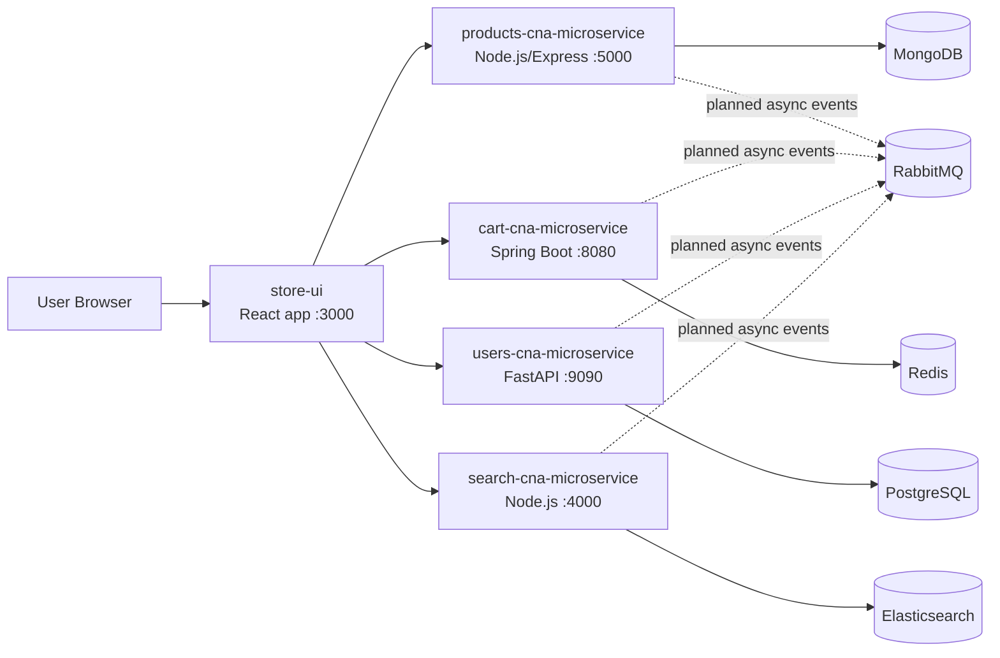
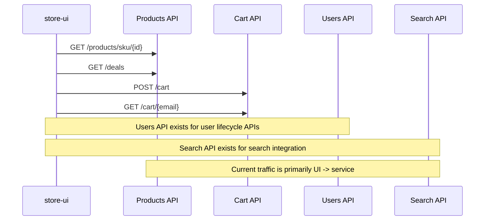
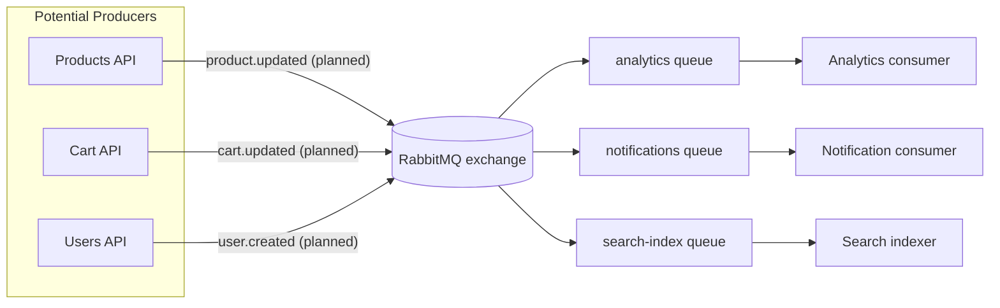
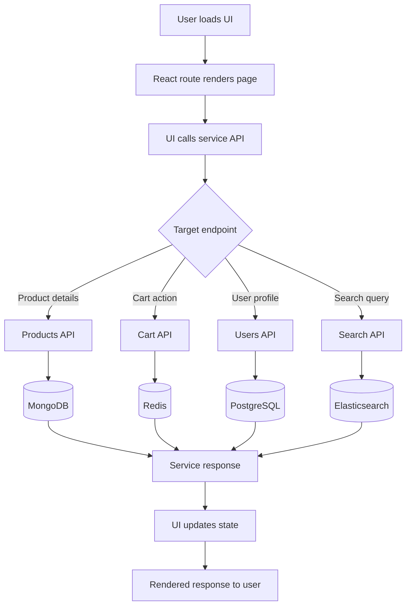

# Architecture Diagrams

These diagrams reflect the current implementation and near-term platform design.

## 1) High-level architecture diagram

## 2) Service-to-service communication diagram

## 3) Event flow diagram (RabbitMQ / async messaging)

## 4) Request lifecycle flowchart

