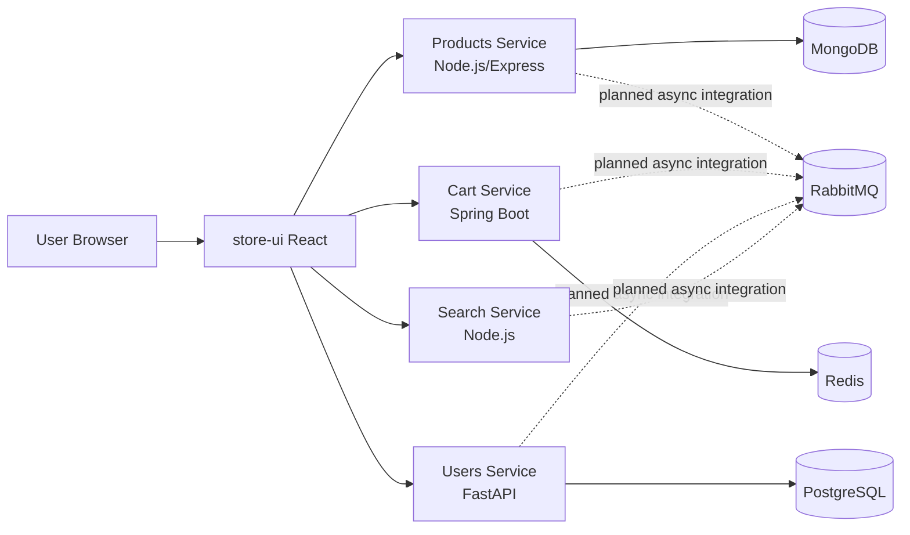

# Architecture

## 1. System overview

This platform uses a microservices architecture with a React storefront and polyglot backend services. Each service owns its runtime and domain concerns. See detailed views in [Architecture Diagrams](./diagrams.md).

### Service map

## 2. Request and data flow

### 2.1 Typical browse-to-cart flow

1. User opens `store-ui`.
2. Frontend requests product list from Products service.
3. Product metadata is returned from MongoDB-backed APIs.
4. User adds an item to cart.
5. Cart service persists/updates cart state (Redis-oriented flow).
6. Optional asynchronous events can be published to RabbitMQ as event-driven features are enabled.

### 2.2 Cross-service communication model

- **Synchronous:** HTTP API calls from frontend to domain services.
- **Asynchronous (planned/iterative):** RabbitMQ-backed events for workflows that should not block user requests.

## 3. Design decisions and trade-offs

### Why polyglot services?

- Enables teams to use best-fit frameworks per domain.
- Demonstrates interoperability patterns used in large organizations.

**Trade-off:** Increased operational complexity (tooling, CI, testing standards across stacks).

### Why multiple databases?

- MongoDB: flexible product schema and catalog iteration speed.
- PostgreSQL: relational consistency for user domain.
- Redis: low-latency cart interactions.

**Trade-off:** More operational expertise needed for backups, observability, and migrations.

### Why event-driven integration?

- Decouples producers/consumers.
- Improves resilience and extensibility.

**Trade-off:** Requires idempotency, schema governance, and better tracing.

## 4. Reliability and scaling model

- Horizontal scaling at service level through Kubernetes Deployments.
- Stateless service design where possible.
- Independent scaling of data stores and queue infrastructure.
- Health/readiness probes recommended for all workloads.

## 5. Security architecture baseline

- API boundary validation in each service.
- Environment-based secret injection (no hardcoded credentials).
- Network segmentation and namespace-level controls in Kubernetes.
- TLS/mTLS evolution path under Istio manifests in `k8s/istio/`.

## 6. Future architecture enhancements

- API gateway with centralized auth and rate limiting.
- Distributed tracing (OpenTelemetry).
- Formal event contracts and versioning.
- Service-level SLOs and error budgets.
